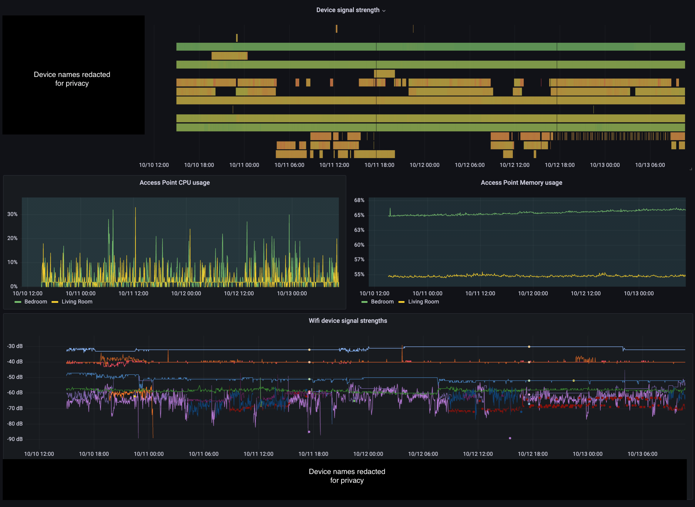

# bt-whole-home-exporter

This project exports metrics from the BT Whole Home Wifi system. Data includes devices, signal strength and access point metrics. They're put on a `/metrics` HTTP endpoint that you can scrape with [Prometheus](https://prometheus.io).

You can run it using:

```sh
go build .
./bt-whole-home-exporter $YOUR_BT_WHOLE_HOME_WIFI_ADMIN_PANEL_PASSWORD_HERE
```

It assumes your BT Whole Home WiFi's admin panel is running on `192.168.1.1`. 

## Grafana dashboard

There is an accompanying Grafana dashboard you can get at [grafana.com/grafana/dashboards/15119](https://grafana.com/grafana/dashboards/15119).



## Maintainance warning

This project is not maintained. I used it for several months and it was extremely reliable with the `Whole Home Wi-Fi v1.02.12 build02` firmware version. I haven't tested it with anything besides the original BT Whole Home WiFi system, but it should be adaptable to the other models (Mini, Premium, etc.)

The code isn't brilliant because (a) strange decisions in the admin panel's security (b) it was built in a hurry. But it should be quite adaptable if you want to take it further. It's MIT-licensed so you're welcome to fork the code.

Also worth noting is that (at the time of writing) there's an [active security issue affecting the latest firmware](https://community.bt.com/t5/BT-Devices/BT-Wi-Fi-Disc-susceptible-to-authentication-bypass/td-p/2177297).
